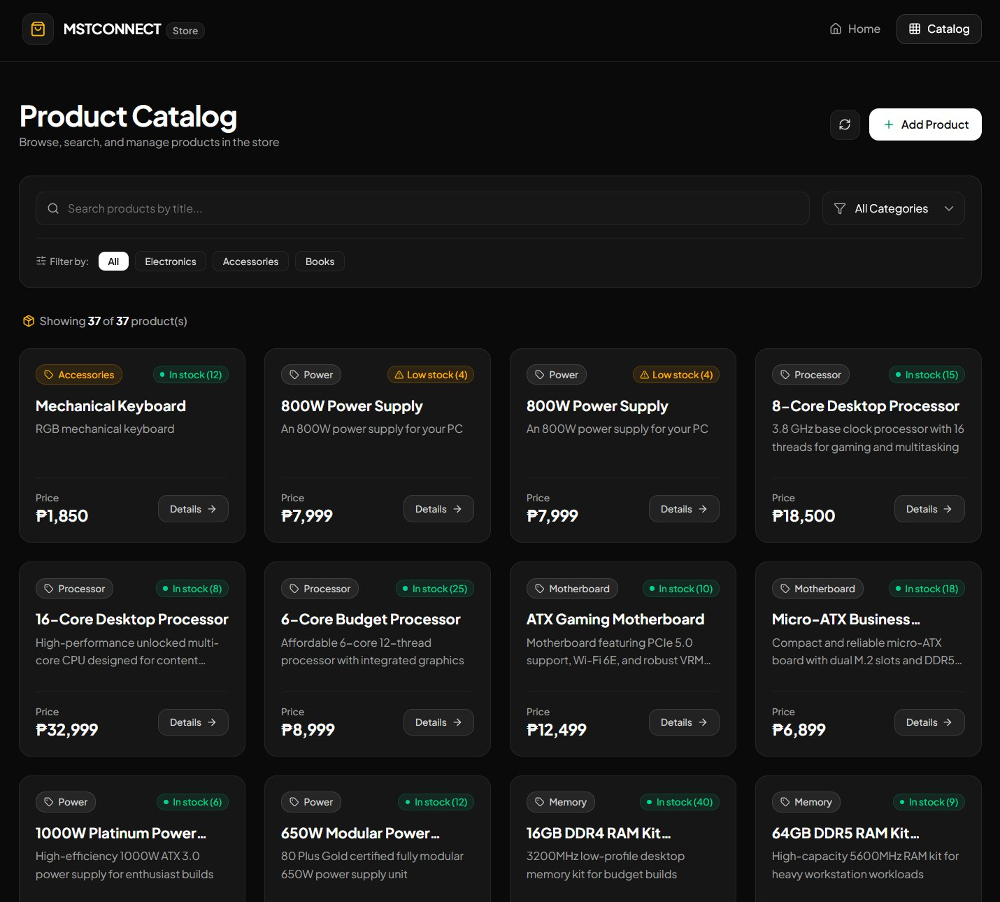

# MSTCONNECT eCommerce Client

[](https://bun.sh)
[](https://react.dev)
[](https://tailwindcss.com)
[](https://vite.dev)

A modern, high-performance eCommerce frontend built with **Bun**, **React 19**, **Tailwind CSS v4**, and **React Router v7**, connecting to a REST API backend.



---

## ⚡ Why Bun First?

This project is configured from the ground up to utilize **Bun** as its primary JavaScript runtime and package manager:
- **Instant Package Installations**: Resolves and installs modules in milliseconds with native `bun.lock`.
- **Integrated Tooling**: Uses `bunfig.toml` and native TypeScript/JSX preservation.
- **Fast Build Times**: Powers Vite dev server and build pipelines with minimal memory overhead.

---

## 🌟 Features

- **Product Catalog (`/products`)**: Real-time product search, category filtering (Electronics, Accessories, Books), live result counter, and quick-filter tabs.
- **Product Details (`/products/:id`)**: Rich product overview, stock badge indicators (In Stock, Low Stock, Out of Stock), price tags, and quick-copy Product ID.
- **Create Product (`/products/new`)**: Accessible controlled form with client-side validation, error messages, and loading state indicators.
- **Tailwind CSS v4 Design System**: Modern dark-mode interface with glassmorphism, responsive grid layouts, custom scrollbars, and accessible controls.
- **Client-Side Routing**: Smooth page transitions powered by React Router v7 and an error-tolerant 404 page.

---

## 🛠️ Tech Stack

- **Runtime & Package Manager**: [Bun](https://bun.sh/)
- **Frontend Framework**: [React 19](https://react.dev/)
- **Routing**: [React Router v7](https://reactrouter.com/)
- **Styling**: [Tailwind CSS v4](https://tailwindcss.com/) with `@tailwindcss/vite`
- **Icons**: [Lucide React](https://lucide.dev/)
- **Bundler**: [Vite](https://vite.dev/)

---

## 🚀 Getting Started

### Prerequisites

- [Bun](https://bun.sh/) (v1.1+) installed on your machine.
- A running backend API instance (e.g. Express server running on port `3000`).

### 1. Installation

Install all project dependencies with Bun:

```bash
bun install
```

### 2. Environment Configuration

Copy the example configuration to `.env`:

```bash
cp .env.example .env
```

Ensure your `.env` contains your backend API URL:

```env
API_URL=http://localhost:3000/api
```

### 3. Run the Development Server

Start the Vite development server using Bun:

```bash
bun dev
```

The application will be running at `http://localhost:5173`.

### 4. Build for Production

Compile the production bundle with Tailwind CSS v4:

```bash
bun run build
```

Preview the production build locally:

```bash
bun run preview
```

---

## 📁 Project Structure

```text
capstone3/
├── bunfig.toml              # Bun runtime & package configuration
├── bun.lock                 # Bun lockfile
├── package.json             # Scripts & dependencies (packageManager: bun@1.4.0)
├── vite.config.js           # Vite + React + @tailwindcss/vite integration
├── index.html               # Entry HTML with Google Fonts (Plus Jakarta Sans)
├── images/                  # Presentation & UI preview assets
│   └── marketplace.jpg
└── src/
    ├── api/                 # API request functions (Fetch API with fallback)
    │   └── productsApi.js
    ├── components/          # Reusable UI elements (Tailwind CSS v4 styled)
    │   ├── CategoryFilter.jsx
    │   ├── EmptyState.jsx
    │   ├── ErrorMessage.jsx
    │   ├── LoadingMessage.jsx
    │   ├── Navbar.jsx
    │   ├── ProductCard.jsx
    │   ├── ProductForm.jsx
    │   ├── ProductList.jsx
    │   └── SearchBar.jsx
    ├── pages/               # Route views
    │   ├── CreateProductPage.jsx
    │   ├── HomePage.jsx
    │   ├── NotFoundPage.jsx
    │   ├── ProductDetailsPage.jsx
    │   └── ProductsPage.jsx
    ├── App.jsx              # Main routing & layout structure with footer
    ├── main.jsx             # React DOM root mounting
    └── styles.css           # Tailwind CSS v4 imports & custom utilities
```

---

## 📄 License & Rights

&copy; 2026 TJ Tolentino. All rights reserved.

